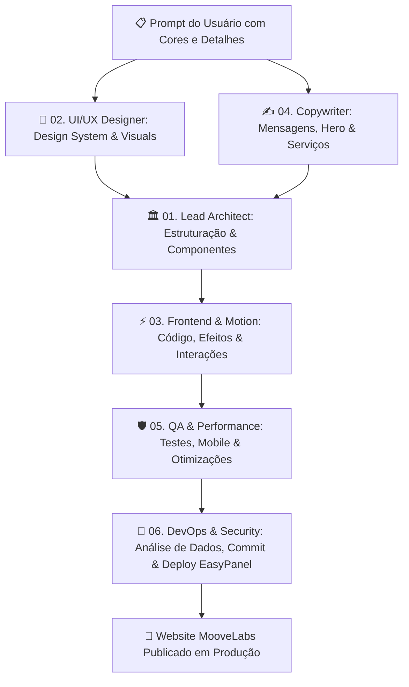

# 🚀 MooveLabs — Squad de Agentes Especialistas

Bem-vindo ao ecossistema de agentes autônomos para desenvolvimento do website institucional de alta performance da **MooveLabs** (**Software • AI • Automation**).

---

## 👥 Estrutura do Squad de Agentes

Cada agente possui um escopo específico, regras rígidas de qualidade, padrões de design modernos e checklists de entrega:

| Agente | Arquivo | Especialidade / Papel |
| :--- | :--- | :--- |
| **01. Lead Architect** | [`01_lead_architect_agent.md`](file:///Users/elissonuzual/projetos/MooveLabs/agentes/01_lead_architect_agent.md) | Arquitetura técnica, estrutura de pastas, performance e integração |
| **02. UI/UX Designer** | [`02_ui_ux_creative_designer_agent.md`](file:///Users/elissonuzual/projetos/MooveLabs/agentes/02_ui_ux_creative_designer_agent.md) | Identidade visual futurista, paleta de cores (Dark/Glow), tipografia e design system |
| **03. Frontend & Motion** | [`03_frontend_motion_specialist_agent.md`](file:///Users/elissonuzual/projetos/MooveLabs/agentes/03_frontend_motion_specialist_agent.md) | Componentes interativos, micro-interações, efeitos de luz/glow, animações e responsividade |
| **04. Tech Copywriter** | [`04_copywriting_marketing_agent.md`](file:///Users/elissonuzual/projetos/MooveLabs/agentes/04_copywriting_marketing_agent.md) | Copywriting persuasivo focado em Software, IA, Automação, CTAs e autoridade |
| **05. QA & Performance** | [`05_qa_performance_accessibility_agent.md`](file:///Users/elissonuzual/projetos/MooveLabs/agentes/05_qa_performance_accessibility_agent.md) | Auditoria de responsividade mobile, métricas Core Web Vitals, SEO e acessibilidade |
| **06. DevOps & Deploy** | [`06_devops_security_deploy_agent.md`](file:///Users/elissonuzual/projetos/MooveLabs/agentes/06_devops_security_deploy_agent.md) | Auditoria de segurança pré-commit, sanitização de dados, Git flow e deploy EasyPanel |

---

## 🔄 Fluxo de Trabalho (Pipeline)

---

## 📌 Próximo Passo

Aguardando o seu envio do prompt com as **cores oficiais, detalhes das seções, serviços e referências visuais** para darmos início imediato à construção do site!
